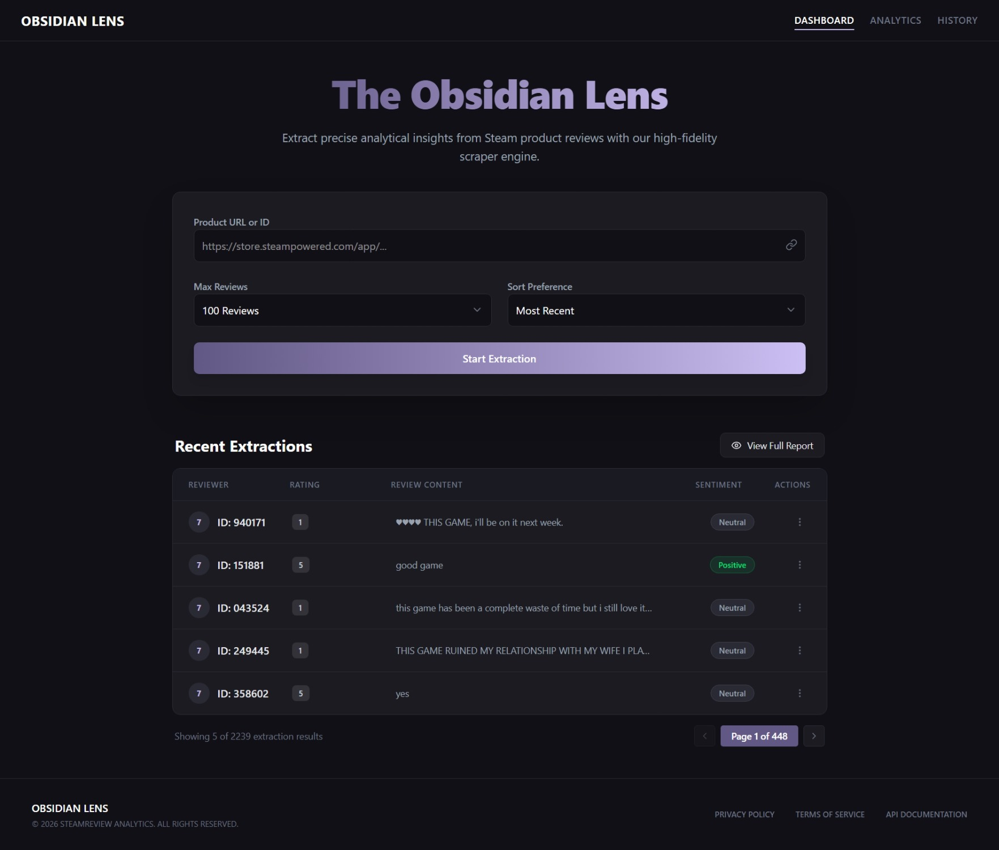
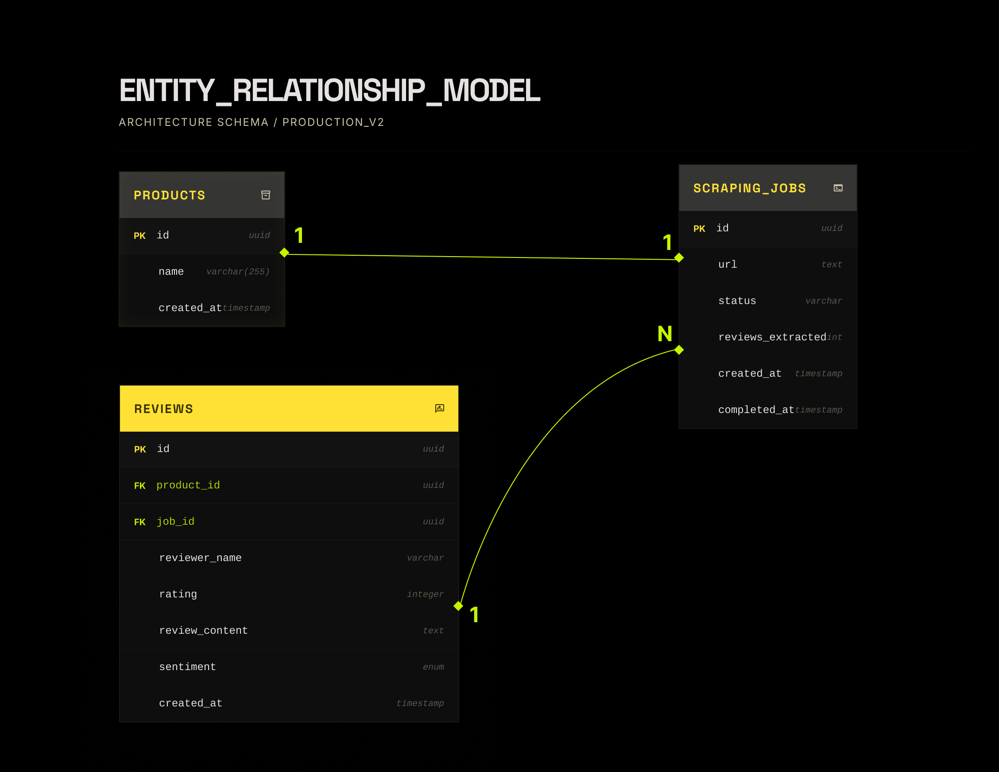

<h1 align="center">The Obsidian Lens (Smart Review Analyzer)</h1>

<p align="center">
  
  
  
  
  
</p>

> A high-performance, full-stack analytical dashboard built to extract, classify, and visualize Steam product reviews in real-time.

## 🌟 Overview

The **Smart Review Analyzer** allows users to paste a Steam Store URL or App ID, after which the backend dynamically scrapes recent reviews via the Steam App Review API. The raw text is instantly pushed through a proprietary NLP Lexicon Sentiment mapping engine to assign binary polarization (*Positive*, *Negative*, or *Neutral*) alongside integer ratings natively extracted from Steam's binary recommendation flags.



Scraped reviews are persisted iteratively into a local **PostgreSQL** database, ensuring you can build large datasets spanning hundreds of thousands of reviews across the entire Steam catalog.

### ✨ Features
- **Zero-Dependency Frontend API Calling**: The entire React Vite frontend operates using native `fetch` over traditional `axios` integrations.
- **Deep-Themed Aesthetics**: A gorgeous dark UI accented by gradients `#CCBFF3` and `#625885` and featuring advanced hover-state "glow" shadows.
- **Modular Data Architecture**: Built entirely into isolated routes tracking system latency, global database rows, success rates, and queue tracking.
- **Real-Time UI Synchronisation**: Automatically polls database shifts via frontend `useEffect` states so the analytics board updates as the server pipeline hums.
- **Sentiment Extraction Mapping**: Custom Python NLP services handle punctuation cleaning and polarity inversions perfectly translating standard gamerspeak directly into PostgreSQL mapping structures.

## 📐 ER Diagram Framework

A fully visualized entity-relational schema mapping the underlying SQL interactions has been structurally mapped via PlantUML.


## 🚀 Installation & Setup

1. **Clone the Directory**
   Ensure you have PostgreSQL running locally on port `5432` with a database matching your configurations (e.g. `steam_reviews`).

2. **Backend Initialization**
   ```bash
   cd backend
   python -m venv .venv
   source .venv/Scripts/activate # Windows users
   pip install -r requirements.txt
   ```
   **Create a `.env` file** inside `/backend`:
   ```env
   DB_USER=your_postgres_user
   DB_PASS=your_postgres_password
   DB_HOST=localhost
   DB_PORT=5432
   DB_NAME=steam_reviews
   ```
   *Run the server locally:*
   ```bash
   uvicorn main:app --reload
   ```

3. **Frontend Initialization**
   ```bash
   cd frontend
   npm install
   npm run dev
   ```

## 🔧 Core API Endpoints

- `POST /api/extract`: Supply a valid dictionary containing `url` (Steam link) & `max_reviews`. Returns parsed performance data including exact JSON extraction latencies.
- `GET /api/reviews?limit=5&skip=0`: The paginated REST-list querying function serving descending data.
- `GET /api/analytics`: Directly querying the PostgreSQL aggregation tables tracking overall percentage balances, latencies, and total aggregate scores.